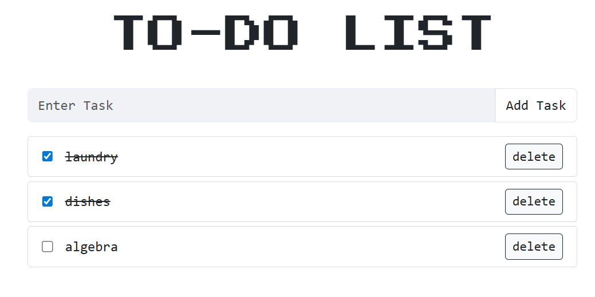

# Todolist App (React + TypeScript + Vite)

A simple task manager built with React, TypeScript, and Vite.

## Features

- Add new tasks
- Mark tasks as complete
- Delete tasks

## Setup

Clone the repository and install dependencies:

```bash
git clone https://github.com/areebafatimaaa/todoList.git
cd todoList
npm install
```

## Development

Run the dev server:

```bash
npm run dev
```

## Build

Create a production build:

```bash
npm run build
```

Preview the build locally:

```bash
npm run preview
```

## Screenshots


